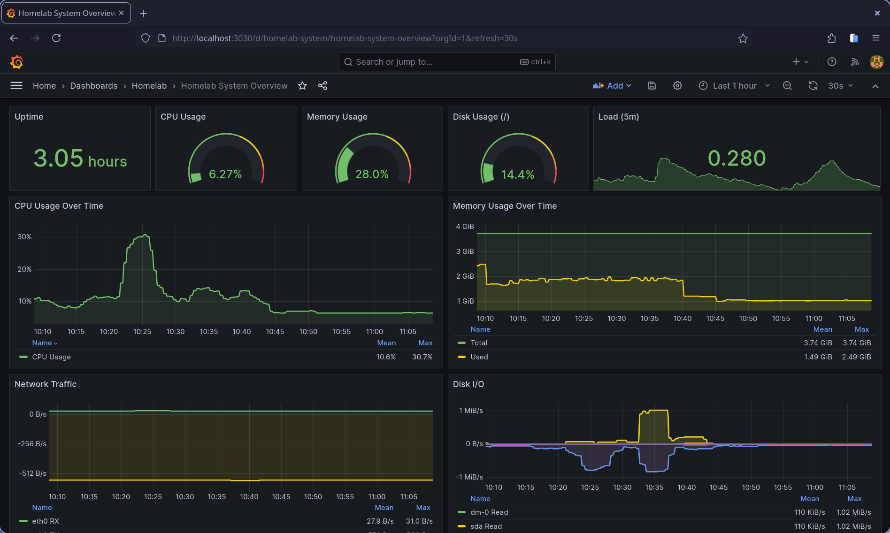
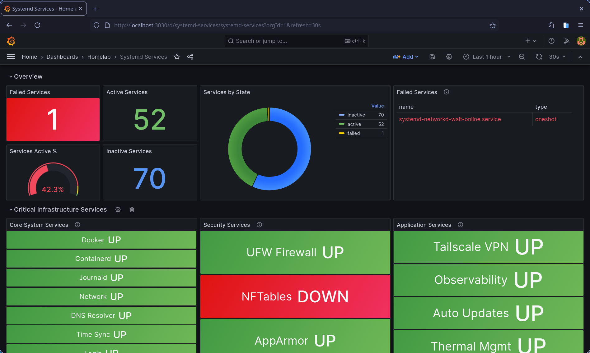

# Homelab Observability Stack

**Production-grade monitoring, logging, and alerting for homelab environments**

[](https://prometheus.io/)
[](https://grafana.com/)
[](https://grafana.com/loki)
[](https://prometheus.io/docs/alerting/latest/alertmanager/)

**Last Updated:** 2026-02-08  
**Version:** 2.0.0  
**Status:** Production Ready

---

## 📋 Table of Contents

- [Overview](#overview)
- [Architecture](#architecture)
- [Features](#features)
- [Components](#components)
- [Prerequisites](#prerequisites)
- [Quick Start](#quick-start)
- [Data Persistence](#data-persistence)
- [Security Considerations](#security-considerations)
- [Common Operations](#common-operations)
- [Troubleshooting](#troubleshooting)
- [Documentation Index](#documentation-index)

---

## Overview

This is a complete, battle-tested observability solution optimized for homelab environments with resource constraints. Unlike enterprise deployments that can throw unlimited resources at monitoring, this stack is designed to run efficiently on modest hardware while maintaining comprehensive visibility into your infrastructure.

### What Problem Does This Solve?

**Before this stack:**
- ❌ No visibility into system health
- ❌ Discover problems after they cause outages
- ❌ Manual log diving across multiple systems
- ❌ No historical data for capacity planning
- ❌ Alert fatigue from noisy monitoring

**After this stack:**
- ✅ Real-time dashboards for all critical metrics
- ✅ Proactive alerting before problems escalate
- ✅ Centralized log aggregation with powerful queries
- ✅ Historical data for trends and capacity planning
- ✅ Actionable alerts only (97 carefully curated rules)

### Design Philosophy

1. **Alert Fatigue Prevention**: Reduced from 122 to 97 alert rules through careful analysis
2. **Resource Efficiency**: Optimized for 4GB RAM systems with strict memory limits
3. **Production Patterns**: Infrastructure as Code, validation, testing, rollback capabilities
4. **Self-Monitoring**: The observability stack monitors itself (Dead Man's Switch, capacity alerts)
5. **Maintainability**: Git-managed configs, automated validation, clear restoration paths

---

## Architecture

```
┌─────────────────────────────────────────────────────────────────────┐
│                         Homelab Infrastructure                       │
│  ┌──────────┐  ┌──────────┐  ┌──────────┐  ┌──────────┐           │
│  │ Docker   │  │ Systemd  │  │ Logs     │  │ System   │           │
│  │ Containers│  │ Services │  │ /var/log │  │ Metrics  │           │
│  └─────┬────┘  └─────┬────┘  └─────┬────┘  └─────┬────┘           │
│        │             │              │             │                 │
│        ▼             ▼              ▼             ▼                 │
│  ┌─────────────────────────────────────────────────────┐           │
│  │              Observability Stack                     │           │
│  │                                                       │           │
│  │  ┌──────────────┐    ┌─────────────┐               │           │
│  │  │  cAdvisor    │───▶│ Prometheus  │◀──────────┐   │           │
│  │  │ (Containers) │    │  (Metrics)  │           │   │           │
│  │  └──────────────┘    └──────┬──────┘           │   │           │
│  │                              │                  │   │           │
│  │  ┌──────────────┐            │         ┌───────┴────────┐      │
│  │  │ Node Exporter│────────────┘         │ Alertmanager   │      │
│  │  │  (Host)      │                      │ (Notifications)│      │
│  │  └──────────────┘                      └────────────────┘      │
│  │                                                 │               │
│  │  ┌──────────────┐    ┌─────────────┐          │               │
│  │  │  Promtail    │───▶│    Loki     │          ▼               │
│  │  │ (Log Ship)   │    │   (Logs)    │     Email/Slack          │
│  │  └──────────────┘    └──────┬──────┘                          │
│  │                              │                                 │
│  │                      ┌───────▼──────────┐                      │
│  │                      │     Grafana      │                      │
│  │                      │  (Visualization) │                      │
│  │                      │   Port: 3000     │                      │
│  │                      └──────────────────┘                      │
│  └─────────────────────────────────────────────────────────────┘ │
└─────────────────────────────────────────────────────────────────────┘
                                 │
                                 ▼
                     Accessible via SSH Tunnel
```

### Data Flow

1. **Metrics Collection:**
   - Node Exporter → Host metrics (CPU, memory, disk, network)
   - cAdvisor → Container metrics (Docker stats)
   - Prometheus → Scrapes exporters every 15s

2. **Log Collection:**
   - Promtail → Tails logs from `/var/log/` and Docker
   - Loki → Stores logs with labels for efficient queries

3. **Alerting:**
   - Prometheus → Evaluates 97 alert rules every 30s
   - Alertmanager → Routes alerts to email/Slack/PagerDuty

4. **Visualization:**
   - Grafana → Queries Prometheus (metrics) and Loki (logs)
   - 6 pre-built dashboards for different use cases

### Screenshots

**System Overview Dashboard:**



*Real-time visibility into CPU, memory, disk, network, and system health at a glance.*

---

**Systemd Services Dashboard:**



*Monitor service status, failures, restarts, and resource usage across all systemd units.*

---

## Features

### 📊 Comprehensive Monitoring

- **System Metrics**: CPU, memory, disk, network, temperature
- **Container Metrics**: Docker resource usage, restart counts, health status
- **Service Monitoring**: Systemd service status, failures, restarts
- **Security Monitoring**: SSH attacks, fail2ban activity, privilege escalation, file integrity
- **Log Aggregation**: Centralized logs with powerful LogQL queries

### 🚨 Intelligent Alerting

- **97 Curated Alert Rules** (reduced from 122 to minimize fatigue)
- **Severity Levels**: Critical (immediate), Warning (batched), Info (dashboard only)
- **Smart Routing**: Critical alerts notify immediately, warnings are grouped
- **Alert Inhibition**: Prevents duplicate notifications (e.g., if critical fires, silence warning)
- **Self-Monitoring**: Dead Man's Switch ensures monitoring is always working

### 📈 Production-Ready Dashboards

1. **Homelab System Overview** (9 panels) - At-a-glance system health
2. **Systemd Services** (14 panels) - Service status and failures
3. **Security Monitoring** (35 panels) - Security events and threat detection
4. **CRON Monitoring** (19 panels) - Scheduled job execution and failures
5. **Docker Security & Stability** (18 panels) - Container health and security
6. **Network Exposure & Socket Monitoring** (14 panels) - Network activity and anomalies

### 🔧 Operational Excellence

- **Hot Reload**: Update Prometheus config without downtime (`systemctl reload observability`)
- **Validation**: All configs validated before deployment
- **Backup Friendly**: All data in `/srv/data/observability/` for easy backups
- **Resource Limits**: Docker memory limits prevent runaway processes
- **Health Checks**: All services have Docker health checks with auto-restart

---

## Components

### Core Services

| Component | Version | Purpose | Memory Limit | Ports |
|-----------|---------|---------|--------------|-------|
| **Prometheus** | v2.48.1 | Metrics collection & alerting | 512M | 9090 |
| **Grafana** | v10.2.0 | Visualization & dashboards | 256M | 3000 |
| **Loki** | v2.9.0 | Log aggregation & indexing | 256M | 3100 |
| **Alertmanager** | v0.26.0 | Alert routing & notifications | 64M | 9093 |
| **Node Exporter** | v1.7.0 | System metrics exporter | 64M | 9100 |
| **cAdvisor** | v0.47.0 | Container metrics exporter | 128M | 8080 |
| **Promtail** | v2.9.0 | Log shipping agent | 64M | 9080 |

**Total Memory**: ~1.4GB reserved, ~2GB at peak usage

### Data Retention

| Component | Retention | Storage Location |
|-----------|-----------|------------------|
| Prometheus | 15 days or 5GB | `/srv/data/observability/prometheus` |
| Loki | 7 days | `/srv/data/observability/loki` |
| Grafana | Unlimited | `/srv/data/observability/grafana` |
| Alertmanager | 5 days | `/srv/data/observability/alertmanager` |

---

## Prerequisites

### System Requirements

- **Operating System**: Linux (Ubuntu 20.04+, Debian 11+, or RHEL 8+)
- **Memory**: 4GB minimum (6GB recommended)
- **Storage**: 20GB free space minimum
- **CPU**: 2 cores minimum
- **Docker**: v20.10+ with Docker Compose v2.0+

### Network Requirements

- **Ports**: 3000, 9090, 9093, 3100 (bound to localhost only)
- **Access**: SSH access for port forwarding
- **Optional**: Tailscale for secure remote access

### Software Dependencies

```bash
# Required
docker          # Container runtime
docker-compose  # Stack orchestration (v2.0+)
systemctl       # Service management

# Optional (for CLI management)
curl            # Prometheus reload
jq              # JSON parsing
promtool        # Alert validation
```

---

## Quick Start

### 1. Clone and Navigate

```bash
cd /opt
git clone https://github.com/yourusername/Homelab.git
cd Homelab/stacks/observability
```

### 2. Configure Environment

```bash
# Create data directories
sudo mkdir -p /srv/data/observability/{prometheus,grafana,loki,alertmanager,promtail}
sudo chown -R 65534:65534 /srv/data/observability/prometheus
sudo chown -R 472:472 /srv/data/observability/grafana
sudo chown -R 10001:10001 /srv/data/observability/loki

# Copy and configure environment
cp .env.example .env
nano .env  # Set GRAFANA_ADMIN_PASSWORD and SMTP settings
```

### 3. Deploy Stack

```bash
# Option A: Using systemd (recommended)
sudo ln -sf $(pwd)/compose.yaml /srv/docker/observability/compose.yaml
sudo ln -sf $(pwd)/.env /srv/docker/observability/.env
sudo cp systemd/observability.service /etc/systemd/system/
sudo systemctl daemon-reload
sudo systemctl enable --now observability

# Option B: Direct Docker Compose
docker compose up -d
```

### 4. Verify Deployment

```bash
# Check service status
docker compose ps

# Check logs
docker compose logs -f prometheus grafana

# Verify health checks
docker ps --filter "name=prometheus" --format "{{.Status}}"
```

### 5. Access Grafana

```bash
# From local machine
ssh -L 3000:localhost:3000 user@homelab

# Open browser
http://localhost:3000

# Login credentials
Username: admin
Password: <from .env file>
```

**For detailed installation instructions, see [INSTALLATION.md](./INSTALLATION.md)**

---

## Data Persistence

### Directory Layout

```
/srv/data/observability/          # Data persistence root
├── prometheus/                   # Metrics TSDB (5GB max)
│   ├── wal/                      # Write-ahead log
│   └── chunks_head/              # Active data chunks
├── grafana/                      # Dashboards and settings
│   ├── grafana.db                # SQLite database
│   └── plugins/                  # Installed plugins
├── loki/                         # Log chunks and indexes
│   ├── chunks/                   # Compressed log data
│   └── boltdb-shipper-active/    # Active indexes
├── alertmanager/                 # Alert state
└── promtail/                     # Position tracking

/srv/docker/observability/        # Runtime (symlinked from git)
├── compose.yaml -> /opt/Homelab/stacks/observability/compose.yaml
└── .env                          # Environment secrets (not in git)
```

### Backup Strategy

```bash
# Stop stack gracefully
sudo systemctl stop observability

# Backup data
sudo tar -czf observability-backup-$(date +%Y%m%d).tar.gz \
  /srv/data/observability/ \
  /srv/docker/observability/.env

# Restart stack
sudo systemctl start observability
```

**For detailed backup procedures, see [OPERATIONS.md](./OPERATIONS.md#backup-and-restore)**

---

## Security Considerations

### Network Security

✅ **All services bind to localhost only** (127.0.0.1)  
✅ **No direct internet exposure** - access via SSH tunnel  
✅ **Tailscale recommended** for secure remote access  
⚠️ **Never expose Grafana directly** to internet without authentication proxy

### Secrets Management

✅ **.env file excluded from git** (chmod 600 recommended)  
✅ **Alertmanager template processed** with envsubst (secrets not in repo)  
✅ **Grafana admin password required** before deployment  
⚠️ **SMTP credentials in plaintext** - use app-specific passwords

### Container Security

✅ **Unprivileged users** where possible (Prometheus: 65534, Grafana: 472)  
✅ **Read-only config mounts** prevent tampering  
✅ **Memory limits enforced** prevent resource exhaustion  
✅ **Health checks** with automatic restart on failure  
⚠️ **cAdvisor requires privileged mode** for container metrics (unavoidable)

### Alert Security

✅ **Security-focused alerts**: SSH attacks, privilege escalation, file integrity  
✅ **Failed login tracking** via fail2ban integration  
✅ **SUID binary monitoring** for unauthorized privilege escalation  
✅ **Docker security events** for container escape attempts

---

## Common Operations

### Starting/Stopping Services

```bash
# Using systemd (recommended)
sudo systemctl start observability    # Start all services
sudo systemctl stop observability     # Stop gracefully
sudo systemctl restart observability  # Restart all
sudo systemctl status observability   # Check status

# Using Docker Compose directly
docker compose up -d        # Start in background
docker compose down         # Stop and remove containers
docker compose restart      # Restart all services
```

### Viewing Logs

```bash
# All services
docker compose logs -f

# Specific service
docker compose logs -f prometheus
docker compose logs -f grafana --tail=100

# Systemd journal
journalctl -u observability -f
```

### Hot Reload (Zero Downtime)

```bash
# Reload Prometheus configuration
sudo systemctl reload observability
# OR
curl -X POST http://localhost:9090/-/reload
```

### Checking Service Health

```bash
# All services status
docker compose ps

# Individual health checks
curl http://localhost:9090/-/healthy  # Prometheus
curl http://localhost:3000/api/health # Grafana
curl http://localhost:3100/ready      # Loki
```

**For comprehensive operational procedures, see [OPERATIONS.md](./OPERATIONS.md)**

---

## Troubleshooting

### Prometheus Won't Start

**Symptom**: Container exits immediately

```bash
# Check configuration syntax
docker run --rm -v $(pwd)/prometheus:/etc/prometheus \
  prom/prometheus:v2.48.1 promtool check config /etc/prometheus/prometheus.yml

# Check alert rules
docker run --rm -v $(pwd)/prometheus:/etc/prometheus \
  prom/prometheus:v2.48.1 promtool check rules /etc/prometheus/alerts.yml
```

**Common Causes**:
- Missing alert file volumes in compose.yaml
- Invalid YAML syntax in alert rules
- File permissions on data directory (should be 65534:65534)

### Grafana Dashboards Show "No Data"

**Symptom**: Panels are empty or show "No data"

```bash
# Verify Prometheus is reachable from Grafana
docker exec grafana curl http://prometheus:9090/-/healthy

# Check Prometheus targets
curl http://localhost:9090/api/v1/targets | jq '.data.activeTargets[] | {job, health}'
```

**Common Causes**:
- Prometheus not healthy (check with `docker compose ps`)
- Node Exporter not running (no host metrics)
- Wrong datasource configuration (should be auto-provisioned)

### Alert Emails Not Sending

**Symptom**: Alerts fire in Prometheus but no email received

```bash
# Check Alertmanager logs
docker compose logs alertmanager | grep -i "error\|fail"

# Test SMTP connection
docker exec alertmanager wget --spider \
  smtp://smtp.gmail.com:587 || echo "SMTP unreachable"
```

**Common Causes**:
- Wrong SMTP credentials in `.env`
- Gmail blocking "less secure apps" (use app-specific password)
- Alertmanager config not regenerated after changing `.env`

### High Memory Usage

**Symptom**: OOMKiller terminating containers

```bash
# Check current memory usage
docker stats --no-stream

# Check Prometheus TSDB size
du -sh /srv/data/observability/prometheus
```

**Solutions**:
- Reduce Prometheus retention: `--storage.tsdb.retention.time=7d`
- Reduce scrape frequency: `scrape_interval: 60s` (in prometheus.yml)
- Check for high cardinality metrics causing memory spike

**For more troubleshooting scenarios, see [TROUBLESHOOTING.md](./TROUBLESHOOTING.md)**

---

## Documentation Index

| Document | Purpose | Audience |
|----------|---------|----------|
| **[README.md](./README.md)** (this file) | Overview and architecture | Everyone |
| **[INSTALLATION.md](./INSTALLATION.md)** | Step-by-step setup guide | New users |
| **[CONFIGURATION.md](./CONFIGURATION.md)** | Configuration reference | Operators |
| **[ALERTS.md](./ALERTS.md)** | Alert rules and customization | Security teams |
| **[DASHBOARDS.md](./DASHBOARDS.md)** | Dashboard guide | Daily users |
| **[OPERATIONS.md](./OPERATIONS.md)** | Day-to-day operations | Operators |
| **[MONITORING.md](./MONITORING.md)** | What to monitor and when | Everyone |
| **[CONTRIBUTING.md](./CONTRIBUTING.md)** | Contributing improvements | Contributors |

---

## Quick Reference

### Important URLs (via SSH tunnel)

- Grafana: http://localhost:3000
- Prometheus: http://localhost:9090
- Alertmanager: http://localhost:9093
- Loki: http://localhost:3100

### Key Files

- Alert Rules: `prometheus/*.yml`
- Dashboards: `grafana/provisioning/dashboards/json/*.json`
- Alert Routing: `alertmanager/alertmanager.yml`
- Environment Config: `.env` (not in git)

### CLI Commands

```bash
# Using homelab CLI (recommended)
./cli/homelab.sh observability status
./cli/homelab.sh observability restart
./cli/homelab.sh observability validate
./cli/homelab.sh observability logs

# Direct systemd
sudo systemctl status observability
sudo systemctl restart observability
sudo systemctl reload observability  # Hot reload
```

---

## Contributing

We welcome contributions! See [CONTRIBUTING.md](./CONTRIBUTING.md) for guidelines.

**Recent Improvements** (2026-02-08):
- ✅ Reduced alert rules from 122 → 97 (20.5% reduction)
- ✅ Fixed 8 missing alert file mounts in compose.yaml
- ✅ Implemented Prometheus hot reload capability
- ✅ Added Dead Man's Switch and capacity monitoring
- ✅ Archived redundant dashboards

---

## License

MIT License - See repository root for details.

---

## Support

- **Issues**: https://github.com/yourusername/Homelab/issues
- **Discussions**: https://github.com/yourusername/Homelab/discussions
- **Documentation**: `/docs/` directory in this repository

---

**Built with ❤️ for the homelab community**
